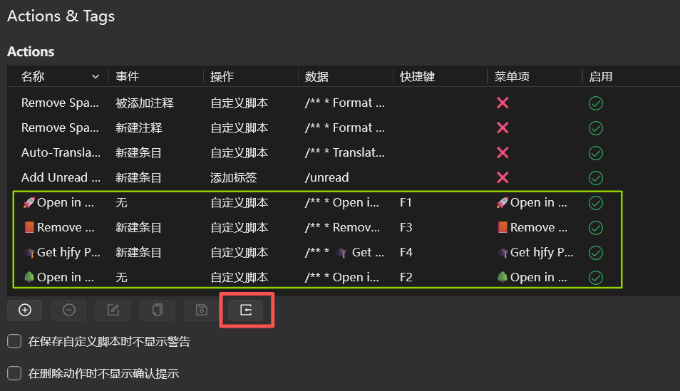
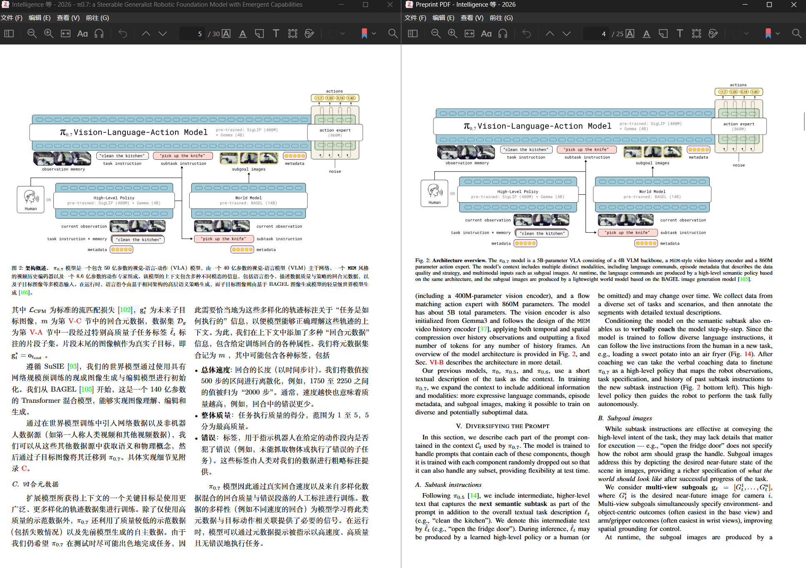
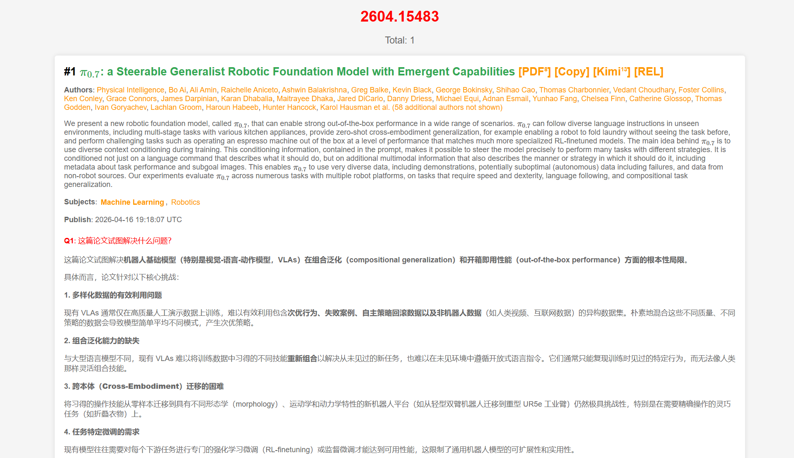
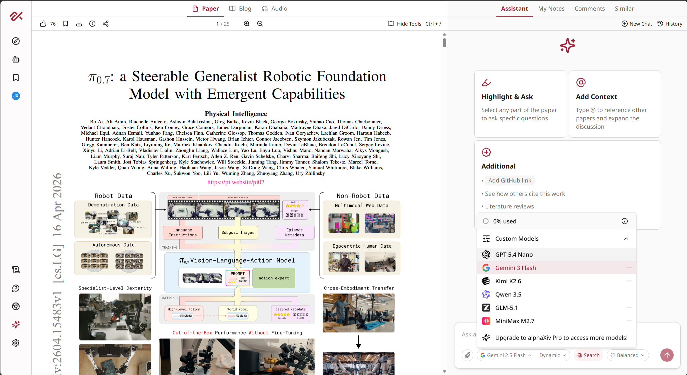
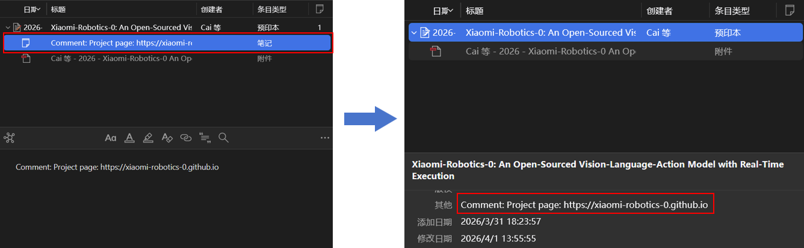

Zotero-Actions
================

**自用轻量的 Zotero 动作脚本，依赖于 Zotero Actions & Tags 插件。**

# 📂Zotero一键导入
- **如下图位置，导入 `Zotero一键导入.yaml`**
  

# 🎓Get hjfy CN_PDF
- **功能：自动获取 hjfy 中文翻译 PDF，导入为附件（未翻译的会自动弹窗并翻译），并优先设为默认打开的 PDF（兼容 Zotero 6、7、8、9、all）**
- **解决：已有插件 Zotero 兼容问题**
- Discussions: https://github.com/windingwind/zotero-actions-tags/discussions/614
  

# 🌳Open in CoolPapers
- **功能：快捷键快速打开论文对应的 [papers.cool](https://papers.cool/) 网页。**
- Discussions: https://github.com/windingwind/zotero-actions-tags/discussions/615
  

# 🚀Open in AlphaXiv
- **功能：快捷键快速打开论文对应的 www.alphaxiv.org 网页。**
- Discussions: https://github.com/windingwind/zotero-actions-tags/discussions/587
  

# 📙Remove Auto-Comment-Notes
- **功能：删除自动添加的注释笔记，并将这些记录的内容添加到"其他"里面。**
- **解决：https://forums.zotero.org/discussion/76496**
- Discussions: https://github.com/windingwind/zotero-actions-tags/discussions/601

